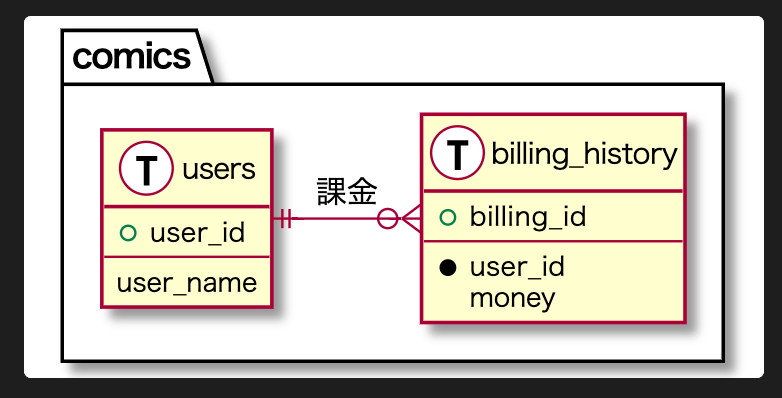

# 設計（ER図） <!-- omit in toc -->

[研修資料](https://docs.google.com/presentation/d/11PYP1KxNmceq7k-kDqB6OGSMfG29F7a0/edit?usp=sharing&ouid=105538813074245543818&rtpof=true&sd=true)

## 目次 <!-- omit in toc -->
- [演習問題の準備](#演習問題の準備)
- [演習問題](#演習問題)
- [ER図を作成する準備](#er図を作成する準備)
- [PlantUMLを使ってみる](#plantumlを使ってみる)
- [参考資料](#参考資料)
## 演習問題の準備

このリポジトリをforkしましょう  
https://gitlab.com/flinters_base/education/entity-relationship-diagram

fork先：`FLINTERS_BASE / cnYYYY_MM / 自分の名前`

forkしたら、cloneしましょう

## 演習問題

漫画アプリ開発におけるER図を作成しましょう。  
また、下記のようなマージリクエストを作り、提出してください。  
https://gitlab.com/flinters_base/education/entity-relationship-diagram/-/merge_requests/2  
※ 作成したER図を説明に追加すること


漫画アプリの機能
- ユーザー登録
- 漫画の閲覧
- 漫画のお気に入り
- 作者の作品リストを閲覧
- 課金すると先読みできる
- （他にも機能を思い付いたら加えても良い）

<details><summary>困ったら見る</summary>

テーブルや項目例
- ユーザーテーブル
  - ユーザーID
  - 生年月日
  - 名前
- 漫画テーブル
  - 漫画ID
  - タイトル
  - 作者名
  - 話数
- 閲覧履歴テーブル
  - ユーザーID
  - 漫画ID
  - 話数
  - 閲覧した時間
- お気に入りテーブル
  - ユーザーID
  - 漫画ID
- 課金履歴テーブル
  - ユーザーID
  - 漫画ID
  - 話数

</details>


## ER図を作成する準備

VS Codeと、PlantUMLのプラグインを用いて作成します。

### VS Codeのダウンロード <!-- omit in toc -->

https://azure.microsoft.com/ja-jp/products/visual-studio-code/

※ 既にインストール済みであればスキップしてください。

### JDKのダウンロード <!-- omit in toc -->

下記コマンドを実行してJavaがインストールされているかを確認しましょう。
```sh
$ java -version
openjdk version "1.8.0_312"
OpenJDK Runtime Environment (Temurin)(build 1.8.0_312-b07)
OpenJDK 64-Bit Server VM (Temurin)(build 25.312-b07, mixed mode)
```

上記のような表示にならない場合は、下記サイトからJDKのダウンロードします。  
https://adoptium.net/?variant=openjdk8&jvmVariant=hotspot

インストーラーを開き、手順に沿ってインストールしてください。

再び`java -version`を実行しましょう。  
バージョンが表示されれば問題ないです。

### Graphviz <!-- omit in toc -->

下記コマンドを実行してGraphvizがインストールされているかを確認しましょう。
```sh
$ dot -V # Vは大文字にすること
dot - graphviz version 2.50.0 (20211204.2007)dot - graphviz version 2.50.0 (20211204.2007)
```

上記のような表示にならない場合は、下記サイトの手順に沿って、Homebrewからインストールします。
```sh
$ brew install graphviz
```

再び`dot -V`を実行しましょう。  
バージョンが表示されれば問題ないです。

### PlantUMLのインストール <!-- omit in toc -->

1. VS Codeを開きます
2. 拡張機能タブを開きます（shift + cmd + X）
3. 検索窓で`plantuml`と検索します
4. PlantUMLが出てくるのでインストールする

<br>

## PlantUMLを使ってみる

図を生成するまで流れをサンプルを用いて実践します。
### pu拡張子のファイルを作成する <!-- omit in toc -->

PlantUMLを用いて作図する場合は、`pu`拡張子のファイルを作成する必要があります。  
なので、`sample.pu` ファイルを作ってみましょう。

### コードを書く <!-- omit in toc -->

下記をコピペしてください。

```pu
@startuml

package "comics" {
  
  entity "users" <<T, fff>> {
    + user_id
    --
    user_name
  }

  entity "billing_history" <<T, fff>> {
    +billing_id
    --
    * user_id
    money
  }

  users ||-o{ billing_history : 課金
}

@enduml
```

### コードから図を作成する <!-- omit in toc -->

`option` + `d`を押すと、コードを読み取り、図が生成されます。

<br>

## 参考資料

こちらの記事を参考にER図を作成しましょう。

- https://medium.com/veltra-engineering/how-to-draw-er-diagram-with-plantuml-86ec2095645e
- https://qiita.com/murakami-mm/items/4c50d1949a8b10016ef7
